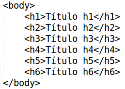
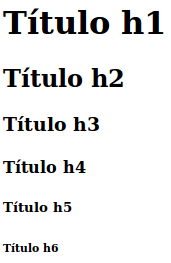
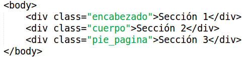
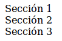
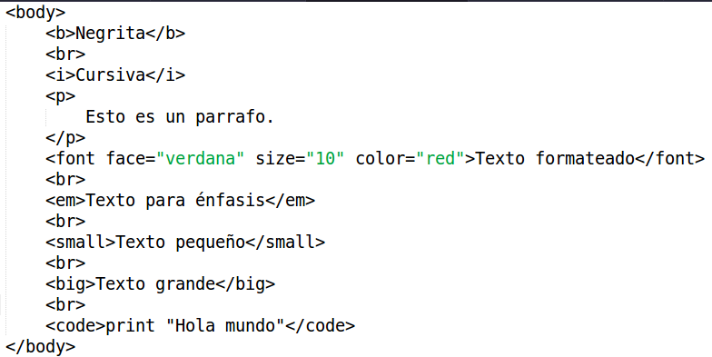
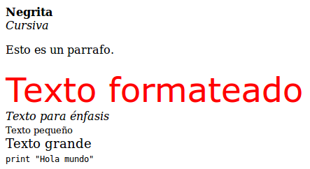

# ¿Qué es HTML5?
HTML5 es la nueva versión del lenguaje de marcado que se usa para estructurar páginas web, actualmente sigue en evolucion, HTML5 incorpora características nuevas y modificaciones que mejorará significativamente la forma de construir sitios web.

HTML5 nos permite crear documentos HTML de una forma más simplificada y sencilla que sus versiones anteriores.

# ¿Qué hay de nuevo en HTML5?
La declaración DOCTYPE es ahora más simple:
```html
<!DOCTYPE html>
```

La codificación de caracteres se hace de la siguiente manera:
```html
<meta charset="UTF-8">
```

### Nuevos tags (etiquetas)
* Nuevos elementos semánticos como: `<header>, <footer>, <article>, y <section>`.
* Nuevos elementos para el control de formularios: `number, date, time, calendar, y range`
* Nuevos elementos gráficos: `<svg> y <canvas>`.
* Nuevos elementos multimedia: `<audio> y <video>`.

### Nuevas API's
* HTML Geolocation
* HTML Drag and Drop
* HTML Local Storage
* HTML Application Cache
* HTML Web Workers
* HTML SSE 

# Plantilla básica de un documento en HTML5
Cualquier documento en HTML5 debe contener la siguiente estructura básica.
```html
<!DOCTYPE html>
<html>
    <head>
        <meta charset="UTF-8">
        <title>Título de la página</title>
    </head>

    <body>
        Cuerpo del documento
    </body>
</html>
```

En la sección de la cabecera `<head>` escribiremos:

* La codificación que ocuparemos para el documento, es recomendado usar UTF-8.
* El título de la página
* Los elementos `link` para utilizar los archivos CSS.

En la sección del cuerpo `<body>` escribiremos:

* Barrá de navegación
* Encabezados
* Secciones
* Parrafos
* Elementos multimedia : audio, video, img 
* Texto en negritas, cursiva y subrayado.
* Tablas
* Listas
* Formularios
* Hipervínculos
* etc.

#  Encabezados
Los encabezados en html tienen 6 tamaños diferentes y se escriben de la siguiente forma:

| HTML  | Resultado |
| ------------- | ------------- |
|   |   |

# Secciones (divisiones)
Podemos dividir nuestro documento en secciones distintas con la etiqueta `<div>` para tener un mayor orden sobre nuestro documento y aplicar diferentes estilos según la sección.

| HTML  | Resultado |
| ------------- | ------------- |
|   |   |

# Formato de texto
Podemos definir diferentes el formato del texto como: negrita, cursiva, subrayado, tipo de letra, tamaño de fuente, saltos de línea, párrafos, citas, etc.

| HTML  | Resultado |
| ------------- | ------------- |
|   |   |


