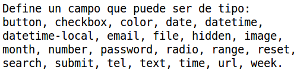

# ¿Qué es HTML5?
HTML5 es la nueva versión del lenguaje de marcado que se usa para estructurar páginas web, actualmente sigue en evolucion, HTML5 incorpora características nuevas y modificaciones que mejorará significativamente la forma de construir sitios web.

HTML5 nos permite crear documentos HTML de una forma más simplificada y sencilla que sus versiones anteriores.

# ¿Qué hay de nuevo en HTML5?
La declaración DOCTYPE es ahora más simple:
```html
<!DOCTYPE html>
```

La codificación de caracteres se hace de la siguiente manera:
```html
<meta charset="UTF-8">
```

### Nuevos tags (etiquetas)
* Nuevos elementos semánticos como: `<header>, <footer>, <article>, y <section>`.
* Nuevos elementos para el control de formularios: `number, date, time, calendar, y range`
* Nuevos elementos gráficos: `<svg> y <canvas>`.
* Nuevos elementos multimedia: `<audio> y <video>`.

### Nuevas API's
* HTML Geolocation
* HTML Drag and Drop
* HTML Local Storage
* HTML Application Cache
* HTML Web Workers
* HTML SSE 

# Plantilla básica de un documento en HTML5
Cualquier documento en HTML5 debe contener la siguiente estructura básica.
```html
<!DOCTYPE html>
<html>
    <head>
        <meta charset="UTF-8">
        <title>Título de la página</title>
    </head>

    <body>
        Cuerpo del documento
    </body>
</html>
```

En la sección de la cabecera `<head>` escribiremos:

* La codificación que ocuparemos para el documento, es recomendado usar UTF-8.
* El título de la página
* Los elementos `link` para utilizar los archivos CSS.

En la sección del cuerpo `<body>` escribiremos:

* Barrá de navegación
* Encabezados
* Secciones
* Parrafos
* Elementos multimedia : audio, video, img 
* Texto en negritas, cursiva y subrayado.
* Tablas
* Listas
* Formularios
* Hipervínculos
* etc.

#  Encabezados
Los encabezados en html tienen 6 tamaños diferentes y se escriben de la siguiente forma:

| HTML  | Resultado |
| ------------- | ------------- |
|   |   |

# Secciones (divisiones)
Podemos dividir nuestro documento en secciones distintas con la etiqueta `<div>` para tener un mayor orden sobre nuestro documento y aplicar diferentes estilos según la sección.

| HTML  | Resultado |
| ------------- | ------------- |
|   |   |

# Formato de texto
Podemos definir diferentes el formato del texto como: negrita, cursiva, subrayado, tipo de letra, tamaño de fuente, saltos de línea, párrafos, citas, etc.

| HTML  | Resultado |
| ------------- | ------------- |
| `<b>`  | Texto en negrita  |
| `<i>`  | Texto en cursiva  |
| `<u>`  | Texto subrayado  |
| `<p>`  | Parrafo  |
| `<code>`  | Escribir en formato código de programación  |
| `<p>`  | Parrafo  |
| `<em>`  | Texto con énfasis  |
| `<br>`  | Salto de línea  |
| `<!--Texto-->`  | Comentarios en lenguaje HTML  |
| `<hr>`  | Línea horizontal para dividir secciones  |
| `<font face="verdana" size="10" color="red">`  | Formatear texto  |

# Formularios

| HTML  | Resultado |
| ------------- | ------------- |
| `<form>`      | Define un Formulario HTML|
| `<input>`     |  |
| `<textarea>`  | Define un textarea para guardar una gran cantidad de texto. |
| `<button>`    | Define un botón|
| `<select>`    | Define una lista desplegable|
| `<option>`    | Define una opción en una lista desplegable|
| `<label>`     | Define una etiqueta para un input|

##Atributos de los formularios 

* Seccion en desarrollo.

# Tablas
 Ejemplo de una tabla básica:

``` html
 <table>
    <thead>
       <tr>
         <th>cabecera</th>
         <th>cabecera</th>
         <th>cabecera</th>
       </tr>
    </thead>
    <tfoot>
       <tr>
         <td>celda</td>
         <td>celda</td>
         <td>celda</td>
       </tr>
    </tfoot>
    <tbody>
       <tr>
         <td>celda</td>
         <td>celda</td>
         <td>celda</td>
       </tr>
    </tbody>
 </table> 
```

Las tablas se escriben con la etiqueta  `<table>`, dentro de la tabla tendremos filas y columnas, la etiqueta `<tr>` define las filas y la etiqueta `<td>` define las columas.

# Hipervínculos e imágenes
Las imágenes pueden ser de formato png, jpg o gif y se escriben con la etiqueta `` entre sus principales atributos tenemos:

* src : La URI a la imágen.
* alt: Texto que se desplegará en caso de que la imagen no sea desplegada.
* width : Ancho de la imagen, puede ser escrita en pixeles o en porcentaje.
* height: Alto de la imagen, puede ser escrita en pixeles o en porcentaje.

Ejemplo:

```html
  
```

Los Hipervínculos o links son definidos con la etiqueta `<a>` que cuenta con los siguientes atributos:

* href : especifica la URI de destino.
* target : especifica en dónde se abrirá el nuevo documento del link.
  * _blank : Abre el nuevo documento en una nueva ventana o pestaña.
  * _self :Abre el nuevo documento en el mismo frame (acción por defecto).
  * _parent : Abre el nuevo documento en el frame padre.
  * _top : Abre el nuevo documento en todo el cuerpo de la ventana.

Ejemplo de un link:

```html
<a href="https://www.facebook.com/oca159">Facebook</a>
``` 

Dentro de las etiquetas `<a>` puede ir un texto o una imagen.

```html
<a href="default.asp">
  
</a> 
```

Los hipervínculos también pueden redireccionar a un segmento específico de la página web. 

Ejemplo: 
Primero creamos una sección con un atributo id.

```html
<div id="Encabezado">Sección de encabezado</div>
```

Entonces agregamos un link que nos envíe a esa sección de la página.
Para lograr este objetivo, agregamos en el atributo `href` el id de la sección precedido de un signo **#**.
```html
<a href="#Encabezado">Visitar la sección de encabezado</a>
```

# Aprender más sobre HTML5
Para profundizar un poco más en HTML5 es recomendable el tutorial de [w3schools](http://www.w3schools.com/html/default.asp).