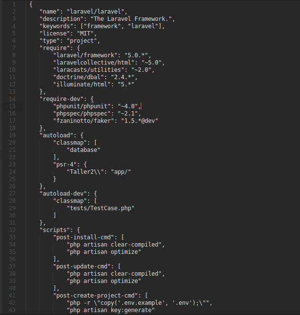

Introducción a Laravel 5
=======

Laravel es un framework para aplicaciones web con sintaxis expresiva y elegante. Creemos que el desarrollo debe ser una experiencia agradable y creativa para que sea verdaderamente enriquecedora. Laravel busca eliminar el sufrimiento del desarrollo facilitando las tareas comunes utilizadas en la mayoría de los proyectos web, como la autenticación, enrutamiendo, sesiones y almacenamiento en caché.

Laravel es un framework para el lenguaje de programación PHP. Aunque PHP es conocido por tener una sintaxis poco deseable, es fácil de usar, fácil de desplegar y se le puede encontrar en muchos de los sitios web modernos que usas día a día. Laravel no solo ofrece atajos útiles, herramientas y componentes para ayudarte a conseguir el éxito en tus proyectos basados en web, si no que también intenta arreglar alguna de las flaquezas de PHP.

Laravel tiene una sintaxis bonita, semántica y creativa, que le permite destacar entre la gran cantidad de frameworks disponibles para el lenguaje. Hace que PHP sea un placer, sin sacrificar potencia y eficiencia. Es sencillo de entender, permite mucho la modularidad de código lo cuál es bueno en la reutilización de código.

### Beneficios de Laravel

1. **Incluye un ORM**: A diferencia de CodeIgniter, Laravel incluye un ORM integrado. Por lo cual no debes instalar absolutamente nada.

2. **Bundles**: existen varios paquetes que extienden a Laravel y te dan funcionalidades increíbles..

3. **Programas de una forma elegante y eficiente**: No más código basura o espaguetti que no se entienden, aprenderás a programar ‘con clase’ y ordenar tu código de manera de que sea lo más re-utilizable posible.

4. **Controlas la BD desde el código**: Puedes tener un control de versiones de lo que haces con ella. A esto se llaman migrations, es una excelente herramienta, porque puedes manejar todo desde tu IDE, inclusive montar datos en tus tablas.

5. **Da soporte a PHP 5.3**.

6. **Rutas elegantes y seguras**: Una misma ruta puede responder de distinto modo a un método GET o POST.

7. **Cuenta con su propio motor de platillas HTML**.

8. **Se actualiza facilmente desde la línea de comandos**: El framework es actualizable utilizando composer update y listo, nada de descargar un ZIP y estar remplazando.

9. **Cuenta con una comunidad activa que da apoyo rápido al momento de que lo necesitas**.

### Requerimientos iniciales

Para empezar a trabajar con Laravel es necesario cumplir con los siguientes requisitos iniciales:

* Un entorno de desarrollo web: Apache, IIS, Nginx
PHP 5.3 o superior
* Base de datos: MySQL, Sqlite, Postgresql o sqlserver
* Librerías php : Mcrypt


****Composer**** es una herramienta para administración de dependencias en PHP. Te permite declarar las librerías de las cuáles tu proyecto depende o necesita y éste las instala en el proyecto por ti.

Composer no es un administrador de paquetes. Sí, él trata con "paquetes" o "librerías", pero las gestiona en función de cada proyecto y no instala nada globalmente en tu equipo, por lo cual solo administra las dependencias del mismo.

Composer usa un archivo dentro de tu proyecto de Laravel para poder administrar las dependencias el cual se llama: **composer.json**. Este usa un formato JSON el cual se explicará más adelante, un ejemplo de él se muestra e esta imagen:



Ahora, composer no se limita a su uso unicamente con proyectos Laravel, sino que en Laravel el uso de composer nos facilita el control de dependencias y en la actualización de cada una como se explicó anteriormente. Para este curso se trabajará con este archivo pues es el que se va a crear al momento de instalar Laravel.

En este archivo podemos observar cierto orden en el acomodo de la información.

* **"name":** En esta sección se describe el nombre del usuario propietario del proyecto seguido del nombre del repositorio que aloja el proyecto separados por una barra(/).

* **"description":** Sirve para facilitar una breve descripción del paquete. Debemos ser muy claros y breves si deseamos colocar una descripción de nuestro paquete.

* **"keywords":** Estas palabras claves son una matriz de cadenas usadas para representar tu paquete. Son similares a etiquetas en una plataforma de blogs y, esencialmente, sirven al mismo propósito. Las etiquetas te ofrecen metadatos de búsqueda para cuando tu paquete sea listado en un repositorio.

* **"homepage":** La configuración de la página es útil para paquetes que van a ser de código libre. Puedes usar esta página para el proyecto o quizá para la URL del repositorio. Lo que creas que es más informativo.

* **"license":** Si tu paquete está pensado para ser redistribuido, querrás ofrecer una licencia con él. Sin una licencia muchos programadores no podrán usar el paquete por restricciones legales. Escoge una licencia que se ajuste a tus requisitos, pero que no sea muy restrictiva para aquellos que esperan usar tu código. El proyecto de Laravel usa la licencia MIT que ofrece gran libertad.

* **"authors":** ofrece información sobre los autores del paquete, y puede ser útil para aquellos usuarios que quieran contactar con el autor o autores. Ten en cuenta que la sección de autores permite una matriz de autores para paquetes colaborativos.

### Gestor de dependencias
Una de las opciones interesantes del archivo composer.json es el campo **“require”**, en el se agregan como un arreglo el nombre de los paquetes que queremos incluir en nuestro proyecto seguido de la versión de cada dependencia.

Al final cuando se han agregado todas las dependencias que queremos para nuestro proyecto entonces solo basta con usar el siguiente comando en nuestra consola:

```
composer install
```

Con esto le indicamos a composer que debe descargar nuestras dependencias y las dependencias de estas dependencias para satisfacer las necesidades de nuestro proyecto. Para más información sobre composer, sus campos y su forma de uso podemos consultar su página oficial https://getcomposer.org/doc/ la cuál se encuentra en inglés.