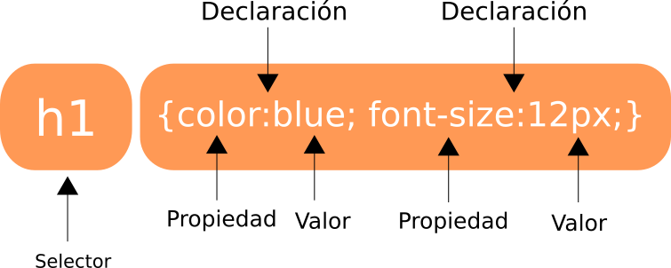

# CSS3 (Hojas de estilo en cascada)
Es un lenguaje usado para definir y crear la presentación de un documento estructurado escrito en HTML o XML.

La idea es separar el contenido (Texto) de su presentación (formato).

La información de estilo puede ser definida en un documento separado o en el mismo documento HTML. En este último caso podrían definirse estilos generales en la cabecera del documento o en cada etiqueta particular mediante el atributo `<style>`.

## Sintaxis

Una hoja de estilo se compone de una lista de reglas. Cada regla o conjunto de reglas consiste en uno o más selectores y un bloque de declaración (o «bloque de estilo») con los estilos a aplicar para los elementos del documento que cumplan con el selector que les precede. Cada bloque de estilos se define entre llaves, y está formado por una o varias declaraciones de estilo con el formato ``propiedad:valor;`` .

En el CSS, los **selectores** marcarán qué elementos se verán afectados por cada bloque de estilo que les siga, y pueden afectar a uno o varios elementos a la vez, en función de su tipo, nombre (name), ID, clase (class), posición dentro del Document Object Model, etcétera.

Abajo puede verse un ejemplo de una parte de una hoja de estilos CSS:  
```css
selector [, selector2, ...] [:pseudo-class][::pseudo-element] {
 propiedad: valor;
 [propiedad2: valor2;
 ...]
}

/* comentarios */
```

Un conjuno de reglas consiste en un selector y un bloque de declaraciones.



## Formas de insertar CSS en nuestro documento HTML
Existen 3 formas de insertar CSS:

* Una hoja de estilo externo (Archivo con extensión .css).
* Una hoja de estilo interna (Dentro del HTML ocupando el tag `<style>`).
* Estilo inline (usando el atributo style sobre un elemento HTML).

#### Hoja de estilo externa
Podemos escribir nuestro CSS en un archivo de nuestro sistema con extensión **.css**, para incluir una referencia a la hoja de estilo externa escribiremos la ruta dentro del atributo href de la etiqueta `<link>`, es conveniente escribir esta definición dentro de la etiqueta `<head>`.

```css
<head>
<link rel="stylesheet" type="text/css" href="mystyle.css">
</head>
```

#### Hoja de estilo interna

Una hoja de estilos interna puede ser usada si una única página tiene un único estilo.

Las hojas de estilo internas son definidas dentro de la etiqueta `<style>` y en la sección de la etiqueta `<head>`.

```css
<head>
<style>
body {
   background-color: linen;
}

h1 {
   color: maroon;
   margin-left: 40px;
}
</style>
</head>
```

#### Estilos inline
Un estilo inline puede ser usado para aplicar un úncio estilo para un único elemento de una página.

Para usar estilos inline , agregamos el atributo  `style` al elemento html.

```css
 <h1 style="color:blue;margin-left:30px;">This is a heading.</h1>
```


## Comentarios en CSS
Los comentarios son una forma de explicar y documentar el código, pueden ser de utilidad  cuando queremos editar el código tiempo después. Los comentarios son ignorados por el navegador.

En CSS un comentario empieza con `/*` y termina con `*/`.
```css
p {
   color: red;
   /* This is a single-line comment */
   text-align: center;
}

/* This is
a multi-line
comment */
```

## Selectores
CSS3 puede aplicar diferentes estilos a un grupo de elementos HTML dependiendo el tipo de selector que ocupemos, veremos cada uno de ellos.

#### Selector por elemento
Selecciona elementos basándose en el nombre del elemento.

Por ejemplo para seleccionar todos los elementos `<p>` de una página y aplicarles el estilo: texto alineado al centro y de color rojo.

```css
p {
    text-align: center;
    color: red;
}
```

#### Selector por id
El selector por id utiliza el atributo id de un elemento HTML para especificar el elemento al que se le va a aplicar un estilo.

Cada id es un valor **único** dentro de una página HTML, por lo cuál la selección sólo se aplicará sobre un único elemento en particular.

Para seleccionar un elemento con un id especifico, escribe un signo de numeral o gato seguido por el valor del id del elemento.

La siguiente regla se aplicará a un elemento HTML con el `id="dato1"`.

```css
#dato1 {
    text-align: center;
    color: red;
}
```

El nombre de un id jamás empieza con un número, al igual que la definición de variables en los lenguajes de programación.

### Selector por clase
El selector por clase selecciona todos los elementos HTML con un atributo class específico.

Para seleccionar elementos con una clase específica, escribimos un punto seguido por el nombre el nombre de la clase.

En el ejemplo de abajo seleccionaremos todos los elementos HTML con `class="center"` y los alinearemos al centro.

```css
.center {
    text-align: center;
    color: red;
}
```

De igual forma es posible seleccionar elementos de un tipo HTML en especifico y luego aquellos con una clase en particular.

En el ejemplo de abajo seleccionaremos los parrafos con `class="center"` y los alinearemos al centro.

```css
p.center {
    text-align: center;
    color: red;
}
```

Al igual que los ids, las clases no deben nombrarse empezando con un número.

#### Agrupar selectores

En el caso de que tuvieramos varios selecciones que apliquen el mismo estilo:

```css
h1 {
    text-align: center;
    color: red;
}

h2 {
    text-align: center;
    color: red;
}

p {
    text-align: center;
    color: red;
}
```

Podemos reducir el código agrupando los selectores separando cada selector por una coma.

```css
h1, h2, p {
    text-align: center;
    color: red;
}
```

# Aprender más sobre CSS3
Para aprender más sobre todos as propiedades y valores existentes en CSS3 así como guías sobre diseño responsivo y otros temas recomendamos visitar la página [w3schools](http://www.w3schools.com/css/default.asp).
