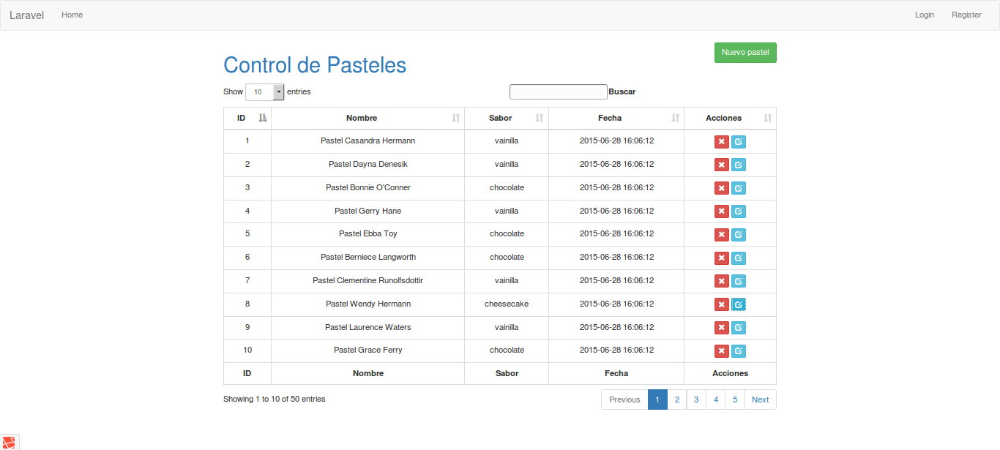
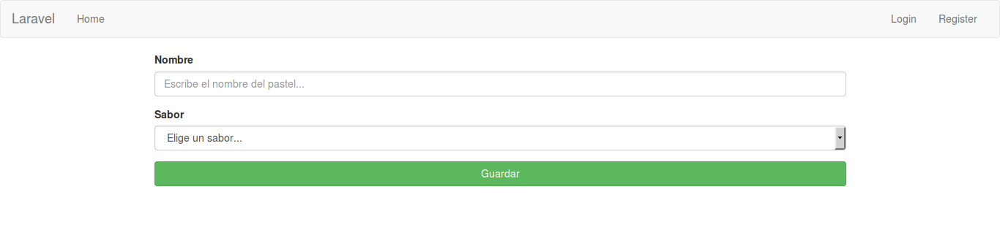
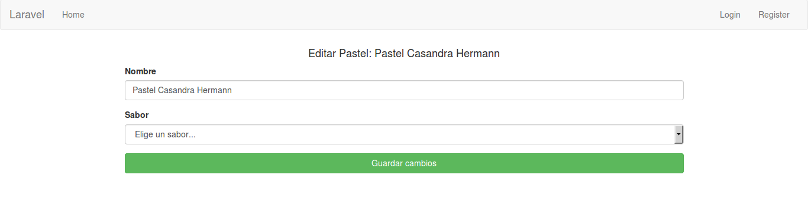

#Creacion del CRUD con Laravel desde 0

Este anexo del libro de Laravel 5 esta pensado para resumir el contenido de una forma aplicada, de modo que se puedan ver en conjunto todos los conocimientos adquiridos durante el curso.

Se explicara el proceso para dar altas, bajas, cambios y consultas de la tabla **pasteles** o [CRUD](https://es.wikipedia.org/wiki/CRUD) que significa **C**reate, **R**ead, **U**pdate and **D**elete por sus siglas en ingles.

Primero retomaremos las [migraciones y los seeders](../capitulos/chapter6.md), creando la migracion y un pequeño seeder para poblar nuestra BD.

Para crear la migracion con la plantilla basica usaremos el comando

```
	php artisan make:migration crear_tabla_pasteles --create=pasteles
```

Ahora dentro de la migracion vamos a definir la estructura de la tabla que tendra solo cuatro campos que seran: id, nombre, sabor y timestamps(esto en BD es igual a created_at y updated_at).

Dando un resultado como lo siguiente:

```
<?php

use Illuminate\Database\Schema\Blueprint;
use Illuminate\Database\Migrations\Migration;

class CrearTablaPasteles extends Migration
{
    /**
     * Run the migrations.
     *
     * @return void
     */
    public function up()
    {
        Schema::create('pasteles', function (Blueprint $table) {
            $table->increments('id');
            $table->string('nombre', 60);
            $table->enum('sabor', ['chocolate','vainilla','cheesecake']);
            $table->timestamps();
        });
    }

    /**
     * Reverse the migrations.
     *
     * @return void
     */
    public function down()
    {
        Schema::drop('pasteles');
    }
}
```

Ahora crearemos el seeder con el comando:

```
	php artisan make:seeder PastelesSeeder
```

y vamos a usar el componente [Faker](https://github.com/fzaninotto/Faker) para crear 50 pasteles de forma automatica, el archivo final quedara de la siguiente forma, recuerden que para usar [Faker](https://github.com/fzaninotto/Faker) es necesario importar la clase con la intruccion **use**:

```
<?php

use Illuminate\Database\Seeder;
use Faker\Factory as Faker;

class PastelesSeeder extends Seeder
{
    /**
     * Run the database seeds.
     *
     * @return void
     */
    public function run()
    {
        $faker = Faker::create();
        for ($i=0; $i < 50; $i++) {
            \DB::table('pasteles')->insert(array(
                   'nombre' => 'Pastel ' . $faker->firstNameFemale . ' ' . $faker->lastName,
                   'sabor'  => $faker->randomElement(['chocolate','vainilla','cheesecake']),
                   'created_at' => date('Y-m-d H:m:s'),
                   'updated_at' => date('Y-m-d H:m:s')
            ));
        }
    }
}
```

Con esto ya tendremos la estructura de la tabla y un seeder para poblar, con esto ahora usaremos el siguiente comando para crear la tabla en la BD y llenarla:

```
	php artisan migrate --seed
```

Ahora vamos a pasar a crear el [Modelo](../capitulos/chapter7.md), el cual nos va a servir para mapear la tabla de la BD a una clase de Laravel como lo vimos en el [capítulo 7](../capitulos/chapter7.md). Vamos a usar el comando:

```
	php artisan make:model Pastel
```

Laravel nos recomienda seguir las convenciones para facilitarnos el trabajo, por lo que las tablas de la Base de datos deben encontrarse en notacion **underscore** y en **plural**, y los modelos deben encontrarse en notacion **UpperCamelCase** y en **singular**.

Con esto Laravel nos creara el archivo Pastel.php en la carpeta ```app/```, si seguimos las convenciones de Laravel por defecto esto seria lo unico necesario, pero debido a que nuestro lenguaje no convierte las palabras a plural de la misma forma que el ingles entonces debemos definir al modelo con que tabla va a estar trabajando. Agregaremos dentro del modelo el atributo ```protected $table = 'pasteles';```, y eso seria todo para el modelo, quedando de la siguiente manera:

```
<?php

namespace Curso;

use Illuminate\Database\Eloquent\Model;

class Pastel extends Model
{
    protected $table = 'pasteles';
}
```

Ya tenemos listo nuestro manejo de datos, ahora vamos a proceder a crear nuestras vistas para que desde el navegador podamos mandar la informacion y un controlador para poder definir nuestras operaciones, ademas de especificar las rutas de nuestro sistema.

Para comenzar vamos a crear nuestro controlador con el comando:

```
	php artisan make:controller PastelesController
```

Laravel automaticamente crea un archivo dentro de la ruta ```app/Http/Controllers``` con el nombre que especificamos y dentro de el las funciones para los metodos: **index**, **create**, **store**, **show**, **edit**, **update**, **delete**. Estos metodos los vamos a definir mas adelante, por el momento vamos a crear en nuestro archivo de rutas un grupo de rutas asociadas a cada uno de los metodos del controlador que acabamos de crear, esto se hace con una ruta de tipo **Resource** o recurso, modificando el archivo routes agregando el siguiente codigo:

```
	Route::resource('pasteles', 'PastelesController');
```

Con esto ya tendremos nuestro controlador(aun vacio) y nuestras rutas del sistema, lo cual podemos verificar con el comando:

```
	php artisan route:list
```

Ahora vamos a terminar de llenar nuestro controlador, debemos importar la clase Pastel a nuestro controlador para poder hacer uso del Modelo y asi trabajar con la base de datos, esto con la ayuda de [Eloquent](../capitulos/chapter7.md), como vimos durante el curso para crear un nuevo registro con Eloquent basta con definir una variable de un **new** Modelo, en este caso **Pastel**, segun se describe en el [capitulo 11](../capitulos/chapter11.md) los metodos responden a una ruta en especifico de la ruta resource que agregamos en **routes.php**, para este caso vamos a definir cada uno de ellos en orden:

####Index - Pagina de Inicio

Cuando entramos a una pagina principal de administracion se pueden ver en ocasiones la informacion que se encuentra en la BD y acceso a las operaciones basicas del CRUD, por lo cual debemos ser capaces de recibir en el index los registros de la BD. Dentro el metodo **index()**, vamos a usa Eloquent para obtener todos los pasteles y enviarlos a una vista que vamos a definir mas adelante, quedando de la siguiente forma:

```
	public function index()
    {
        $pasteles = Pastel::get();
        return view('pasteles.index')->with('pasteles', $pasteles);
    }
```

Eloquent nos facilita mucho las consultas a la BD y hace que sea portable nuestro codigo, en el metodo decimos que seleccione todos los pasteles y os envie a una vista llama **index** ubicada en la carpeta ```resoures/views/pasteles/```, como vimos en el [capitulo 10](../capitulos/chapter10.md) las rutas en blade cambian la **/**(diagonal) por un **.**(punto), la funcion ```view('pasteles.index');``` toma como carpeta raiz a ```resources/views/``` por lo que no tenemos la necesidad de agregarlo en la ruta. Ademas se esta concatenando el metodo ```with('nombre', $var);``` que como **primer** parametro pide el nombre con el cual se va a poder usar una variable del lado de la vista, y como **segundo** parametro recibe la variable que se va a mandar a la vista.

####Create - Pagina de registro

Este metodo es muy sencillo puesto que solo va a devolver una vista sin ninguna variable ni uso de Eloquent, por lo cual queda de la siguiente manera:

```
	public function create()
    {
        return view('pasteles.create');
    }
```

####Store - Funcion de almacenamiento

Este metodo es donde despues de haber entrado a **create** se reciben los datos y se guardan en la base de datos, para poder recibir la informacion en este ejemplo vamos a usar la clase **Request** que significa peticion y es una clase que Laravel agrega por nosotros cuando creamos el controlador, vamos a pasar por parametro la peticion en el metodo definiendo que es una variable de la clase **Request** y despues de eso podemos recuperar por el nombre del campo del formulario(atributo **name**) la informacion enviada, entonces el metodo quedaria de la siguiente forma:

```
	public function store(Request $request)
    {
        $pastel = new Pastel;
        $pastel->nombre = $request->input('nombre');
        $pastel->sabor  = $request->input('sabor');

        $pastel->save();

        return redirect()->route('pasteles.index');
    }
```

En la funcion estamos creando una instancia de un nuevo Pastel y asignando los atributos de la clase que se llaman igual que los campos de la BD los valores del formulario con la variable request y el metodo ```input('name');``` que recibe como parametro el nombre del campo del formulario, para mas detalle revise la seccion del [Anexo A de HTML](../anexos/HTML.md) que habla sobre los atributos de los formularios.

Despues de asignar los valores de la peticion a la variable ```$pastel```, se usa el metodo ```save();``` para que el modelo se encargue de guardar los datos en la BD y finalmente redireccionar al index con los metodos encadenados: ```redirect()->route('pasteles.index');```.

####Show - Pagina de descripcion

* Lo sentimos, seccion en desarrollo.

####Edit - Pagina de edicion

La funcion de edit es similar a la de create pues solo muestra una vista, con una pequeña diferencia, la cual es que se va a buscar el pastel que se quiere editar y se va a mandar a la vista, esto es obio pues debemos poder ver la informacion que vamos a editar. La funcion quedaria de la siguiente forma:

```
    public function edit($id)
    {
        $pastel = Pastel::find($id);
        return view('pasteles.edit')->with('pastel',$pastel);
    }
```

Es muy claro, en una variable se guarda el pastel, gracias al modelo esto se soluciona facilmente con el metodo ```find()```, el id del pastel se manda en la url, ahora bien si esto es preocupante puesto que el id se ve directamente en la URL recordemos que esto no modifica aun, solo nos manda a la pagina que va a poder hacer una nueva peticion para actualizar.

####Update - Funcion de actualizacion

Bien, despues de entrar en la pagina de edit vamos a poder editar la informacion y regresarla al controlador para que efectue los cambios, dentro del metodo **update** vamos a recuperar nuevamente el Pastel por medio de su id que tambien va en la url y se recibe como parametro de la funcion, ademas vamos a agregar otro parametro que sera el Request al igual que en la funcion **create** para recuperar la informacion del lado del cliente en el controlador, dejando la funcion de esta forma:

```
    public function update(Request $request, $id)
    {
        $pastel = Pastel::find($id);
        $pastel->nombre = $request->input('nombre');
        $pastel->sabor  = $request->input('sabor');
        $pastel->save();
        return redirect()->route('pasteles.index');
    }
```

Esta funcion es similar a la de create lo unico que cambia es que en vez de crear un nuevo pastel vamos a recuperar uno existente y cambiar sus atributos.

####Destroy - Funcion de borrado

Este metodo tiene la funcion de eliminar el registro de la BD, pero para efectuarlo tenemos dos opciones, la **primer** forma: crear una variable ```$pastel``` y despues usar el metodo ```delete()``` de Eloquent. o bien la **segunda**: directamente del modelo usar el metodo de Eloquent ```destroy($id)```, que se encarga de directamente buscar y eliminar el registro, finalmente vamos a redirigir al index, el metodo al final quedara de la siguiente forma:

```
    // Esta es la primer opcion
	public function destroy($id)
    {
        $pastel = Pastel::find($id);
        $pastel->delete();
        return redirect()->route('pasteles.index');
    }

    // Esta es la segunda opcion
    public function destroy($id)
    {
        Pastel::destroy($id);
        return redirect()->route('pasteles.index');
    }
```

#Vistas del CRUD

Estas son la ultima parte que vamos a crear, primero debemos preparar los directorios y los archivos que usaremos.

La estructura de la carpeta quedaria de la siguiente forma:

```
resources/
	views/
		pasteles/
			partials/
				fields.blade.php
				table.blade.php
            create.blade.php
            edit.blade.php
			index.blade.php
```

Usaremos el **template** por defecto de Laravel llamado ```app.blade.php``` que fuimos modificando durante el curso por lo cual solo deberemos crear los archivos restantes.

Ahora en el archivo **app.blade.php** vamos a modificarlo para que el contenido este mejor acomodado usando [Bootstrap](http://getbootstrap.com/css/) y vamos  a agregar los estilos y scripts para quela tabla donde vamos a mostrar el contenido funcione como un [DataTable](https://www.datatables.net/), dejando el archivo app de la siguiente forma:

###Template App

```html
<!DOCTYPE html>
<html lang="en">
<head>
    <meta charset="utf-8">
    <meta http-equiv="X-UA-Compatible" content="IE=edge">
    <meta name="viewport" content="width=device-width, initial-scale=1">
    <title>Laravel</title>
    @section('styles_laravel')
    {!! Html::style('assets/css/bootstrap.css') !!}
    {!! Html::style('assets/css/datatable-bootstrap.css') !!}
    <!-- Fonts -->
    <link href='//fonts.googleapis.com/css?family=Roboto:400,300' rel='stylesheet' type='text/css'>
    @show
    @yield('my_styles')
</head>
<body>
    @include('partials.layout.navbar')
    @include('partials.layout.errors')
    <div class="container">
        <div class="row">
            <div class="col-md-10 col-md-offset-1">
                @yield('content')
            </div>
        </div>
    </div>
    <!-- Scripts -->    
    {!! Html::script('assets/js/jquery.js') !!}
    {!! Html::script('assets/js/jquery.dataTables.js') !!}
    {!! Html::script('assets/js/bootstrap.min.js') !!}
    {!! Html::script('assets/js/datatable-bootstrap.js') !!}
    <script>
        $(document).ready(function(){
            $('#MyTable').dataTable();
        });
    </script>

    @yield('my_scripts')
</body>
</html>
```

Los cambios mas notorios que podemos observar es que el **@yield('content')** se metio dentro de una columna con un offset, eso dentro de una fila y todo dentro de un contenedor. Asi nuestro contenido no lo vamos a tener todo pegado a la izquierda de nuestro navegador.

**Nota**: para poder hacer esto soN necesarios los archivos que se incluyen con blade, si no los agregan la tabla se vera mas sencilla pero esto no quiere decir que no va a funcionar, ya solo es cuestion de estilo, si quieren obtener los archivos dejamos los links a continuacion para que los descarguen y los guarden dentro de la carpeta respectiva, es decir los **CSS** en ```public/assets/css/``` y los **JS** dentro de ```public/assets/js/```:

* Estilos para el DataTable: [datatable-bootstrap.css](../material/css/datatable-bootstrap.css).

* Archivo JQuery: [jquery.js](../material/js/jquery.js).

* Archivo JQuery para DataTable: [jquery.dataTables.js](../material/js/jquery.dataTables.js).

* Archivo JQuery para DataTable de bootstrap: [datatable-bootstrap.js](../material/js/datatable-bootstrap.js).

###Vista Index

Esta vista se refiere al archivo **index.blade.php** dentro de la carpeta ```resources/views/pasteles/```, aqui vamos a mostrar la tabla y un boton para crear nuevos pasteles. Ahora bien para esto debemos tener nuestro **partial** de la tabla, mas adelante lo vamos a mostrar pero por el momento el archivo index quedaria de la siguiente forma:

```
@extends('app')

@section('content') 
    <a class="btn btn-success pull-right" href="{{ url('/pasteles/create') }}" role="button">Nuevo pastel</a>
    @include('pasteles.partials.table')
@endsection
```

Recuerden que gracias a blade nuestras vistas quedan de tamaños pequeños mas faciles de entender, aqui solo estamos heredando la plantilla **app** y definiendo la seccion **content** con un link que le daremos estilo de boton con la ruta para mostrar la vista de crear pasteles, ademas de importar nuestra tabla, el archivo partial lo definiremos ahora.

###Partials: table y fields

####Table

Estos archivos los trabajaremos en partials por comodidad y porque son componentes de un sistema Web que suelen repetirse constantemente, empezaremos por el table.

Primero recordemos un poco del pasado, en nuestro controlador en el metodo index definimos que retornaria la vista index junto con una variable llamada ```$pasteles``` que conteneria todos los pasteles del sistema, ahora bien esos pasteles los vamos a vaciar en la tabla pues si bien no especificamos que esa variable va a llegar al partial **table** como lo estamos incluyendo en el index tambien comparte las variables que tenga index, entonces el envio puede verse de la siguiente manera:


Entonces vamos a usar un foreach con **blade**, para llenar el contenido de la tabla con los atributos de los pasteles, dejando el archivo asi:

```
<h1 class="text-primary">Control de Pasteles</h1>

<table class="table table-bordered" id="MyTable">
  <thead>
    <tr>
        <th class="text-center">ID</th>
        <th class="text-center">Nombre</th>
        <th class="text-center">Sabor</th>
        <th class="text-center">Fecha</th>
        <th class="text-center">Acciones</th>
    </tr>
  </thead>
  <tbody>
    @foreach($pasteles as $pastel)
        <tr>
            <td class="text-center">{{ $pastel->id }}</td>
            <td class="text-center">{{ $pastel->nombre }}</td>
            <td class="text-center">{{ $pastel->sabor }}</td>
        <td class="text-center">{{ $pastel->created_at }}</td>
        
        {!! Form::open(['route' => ['pasteles.destroy', $pastel->id], 'method' => 'DELETE']) !!}

            <td class="text-center">
                <button type="submit" class="btn btn-danger btn-xs">
                    <span class="glyphicon glyphicon-remove" aria-hidden="true"></span>
                </button>
                <a href="{{ url('/pasteles/'.$pastel->id.'/edit') }}" class="btn btn-info btn-xs">
                    <span class="glyphicon glyphicon-edit" aria-hidden="true"></span>
                </a>
            </td>
        
        {!! Form::close() !!}

        </tr>
    @endforeach
  </tbody>
  <tfoot>
    <tr>
        <th class="text-center">ID</th>
        <th class="text-center">Nombre</th>
        <th class="text-center">Sabor</th>
        <th class="text-center">Fecha</th>
        <th class="text-center">Acciones</th>
    </tr>
  </tfoot>
</table>
```

La estructura de la tabla la pueden ver en [este link](http://www.w3schools.com/html/html_tables.asp), pero lo importante esta dentro del ```<tbody>```, en donde con **BLADE** vamos a usar un foreach diciendo que para cada pastel dentro de la variable **$pasteles** que llego del controlador se van a vaciar sus datos dentro de la fila de la tabla, primero vamos a agregar su id, nombre y fecha de creacion, pero se va a agregar una columna de acciones que contenga dos botones, uno para eliminar ese registro y otro para editarlo, el boton de eliminar debe ser de tipo submit para enviar la peticion **DELETE** y para esto es que se abre un formulario con la clase **Form::** de Laravel, para que asi que de sintaxis mas legible, agregamos los campos necesarios que son la ruta y el metodo del formulario; para el boton de edit basta con un link ```<a>``` que con la funcion ```url()``` de Laravel la vamos a dirigir con el ID de cada pastel.

**Nota**: Bootstrap nos permite tener a disposicion iconos para que los botones de nuestras acciones se vean mas profesionales, por lo cual es lo que se agrega el tag ```<span>```, para mas informacion ir a la pagina oficial de [Bootstrap](http://getbootstrap.com).

Con esto debemos ser capaces de poder ver ahora nuestra tabla como un DataTable(en caso de haber agregado lo necesario) llena con la informacion de pasteles:



####Fields

Ahora vamos a crear un partials con los campos que va a requerir nuestro proyecto, si bien sabemos es necesario pedir al usuario el nombre y sabor del pastel, pero la fecha de creacion y ultima actualizacion son campos que Laravel pone automaticamente cuando se ejecuta el metodo ```save()``` en el controlador, por lo cual nuestro partial solo debera tener dos campos de entrada y un boton para enviar la solicitud.

Entonces para este archivo solo vamos a agregar como su nombre lo indica los campos de entrada para un paste, dejandolo de la siguiente forma:

```
<div class="form-group">
    {!! Form::label('nombre', 'Nombre', ['for' => 'nombre'] ) !!}
    {!! Form::text('nombre', null , ['class' => 'form-control', 'id' => 'nombre', 'placeholder' => 'Escribe el nombre del pastel...' ]  ) !!}
</div>

<div class="form-group">
    {!! Form::label('sabor', 'Sabor', ['for' => 'sabor'] ) !!}
    <select name="sabor" class="form-control">
        <option value="" disabled selected>Elige un sabor...</option>
        <option value="chocolate">Chocolate</option>
        <option value="vainilla">Vainilla</option>
        <option value="cheesecake">Cheesecake</option>
    </select>
</div>
```

Si bien la clase ```Form::``` no se ha explicado detalladamente dejo el [link](http://laravel.com/docs/4.2/html) de la documentacion oficial de Laravel, aunque se encuentra en su version 4.2 es debido a que para las versiones mas actuales no se encuentra explicada, pero sigue siendo completamente compatible con Laravel 5 y 5.1.

Con este partial vamos a poder llamar los campos de entrada para crear o editar un pastel.

###Vista Create

En esta vista al igual que el index quedara muy corta:

```
@extends('app')

@section('content')
    {!! Form::open([ 'route' => 'pasteles.store', 'method' => 'POST']) !!}
        @include('pasteles.partials.fields')
        <button type="submit" class="btn btn-success btn-block">Guardar</button>
    {!! Form::close() !!}
@endsection
```

Extendemos del template **app**, definimos el contenido abriendo un formulario pero como se trata de un almacenamiento el metodo se va a trabajar con **store** y **POST**, dentro vamos a incluir el partial de **fields** para tener los campos de texto, el menu de opciones y un boton de tipo submit para mandar la peticion.

Deberia quedar un resultado similar a este:



###Vista Edit

Al tener ya listos nuestros archivos HTML la vista de edit se crea de la misma forma que la de create con la diferencia de que en vez de abrir un formulario vamos a abrir un modelo, es deir vamos a abrir el objeto que se envio del controlador a la vista para poder editar los campos, como observacion podran notar cuando lo ejecuten en el navegador que un select no se asigna automaticamente en valor anterior, por el momento vamos a ver como quedaria la vista:

```
@extends('app')

@section('content')
    <h4 class="text-center">Editar Pastel: {{ $pastel->nombre  }}</h4>
    {!! Form::model($pastel, [ 'route' => ['pasteles.update', $pastel], 'method' => 'PUT']) !!}
        @include('pasteles.partials.fields')
        <button type="submit" class="btn btn-success btn-block">Guardar cambios</button>
    {!! Form::close() !!}
@endsection
```

Al igual que las demas vistas se esta heredadndo de **app** y se agrega un titulo para saber que pastel se esta editando, pero el ```Form::model()``` abre nuestra variable ```$pastel``` que enviamos desde el controlador y crea un formulario lleno a partir de los valores del modelo, claro que esto solo para los campos que coincidan con los nombres de los atributos del modelo.

El resultado seria algo similar a esto:



Y con esto quedarian nuestras vistas del sistema terminadas y el CRUD basico de los **Pasteles** finalizado tambien, para mas informacion pueden retomar los capitulos de este libro para analizar las diferentes opciones que tenemos para resolver este ejemplo pues esta es solo una propuesta, no una solucion definitiva.

**nota**: La seccion de show no se ha contemplado para este anexo con una vista, disculpen las molestias.