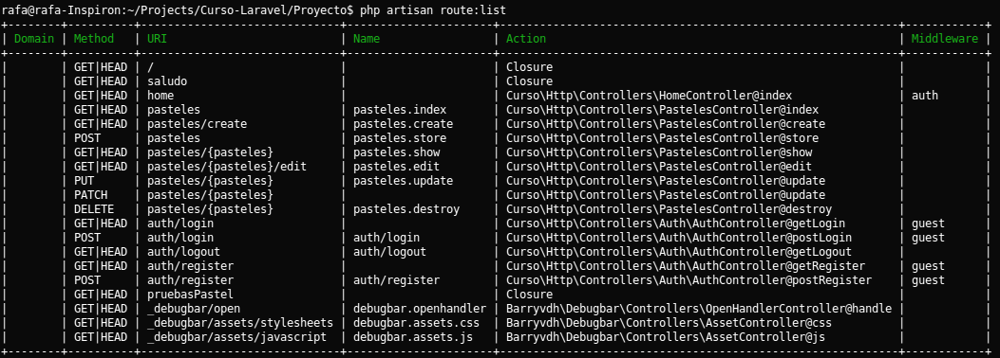

#Controladores

En lugar de definir en su totalidad la lógica de las peticiones en el archivo routes.php, es posible que desee organizar este comportamiento usando clases tipo Controller. Los **Controladores** puede agrupar las peticiones HTTP relacionada con la manipulación lógica en una clase. Los **Controladores** normalmente se almacenan en el directorio de aplicación ```app/Http/Controllers/```.

Un controller usualmente trabaja con las peticiones:

* **GET.**
* **POST.**
* **PUT.**
* **DELETE.**
* **PATCH.**

Asociando los métodos de la siguiente forma:

* **GET:** index, create, show, edit.
* **POST:** store.
* **PUT:** update.
* **DELETE:** destroy.
* **PATCH:** update.


Los controladores nos ayudan a agrupar estas peticiones en una clase que se liga a las rutas, en el archivo ```app/Http/routes.php```, para esto usamos un tipo de ruta llamana resource:

```
Route::resource('pasteles', 'PastelesController');
```

Esta ruta nos creara un grupo de rutas de recursos con las peticiones que estas mencionadas arriba: **index, create, show, edit, store, update, destroy**. Estas son las operaciones mas usadas en una clase y para no tener que crear una ruta para cada método es que Laravel agrupa todo esto con una ruta de tipo resource que se liga a un controlador.

Estos métodos significan:

* index: Es el método inicial de las rutas resource, usualmente lo usamos para mostrar una vista como página principal que puede contener un catalogo o resumen de la información del modelo al cual pertenece o bien no mostrar información y solo tener la función de página de inicio.

* create: Este método lo podemos usar para direccionar el sistema a la vista donde se van a recolectar los datos(probablemente con un formulario) para después almacenarlos en un registro nuevo, usualmente redirige al index.

* show: Aqui podemos hacer unna consulta de un elemento de la base de datos o de todos los elementos o registros por medio del modelo para realizar una descripcion.

* edit: Este método es similar al de **create** porque lo podemos usar para mostrar una vista que recolecta los datos pero a diferencia de create es con el fin de actualizar un registro.

* store: Aqui es donde se actualiza un registro en especifico que proviene del método create y normalmente redirige al index.

* update: Al igual que el store, solo que en vez de provenir de create proviene de **edit** y en vez de crear un nuevo registro, busca un existente y lo modifica, tambien suele redirigir al index.

* destroy: En este método usualmente se destruye o elimina un registro y la petición puede provenir de donde sea siempre y cuando sea llamado con el método **DELETE**, después puede redirigir al index o a otro sitio dependiendo si logro eliminar o no.

Ahora esto no quiere decir que un controlador necesariamente debe ejecutar estas peticiones obligatoriamente, podemos omitirlas o incluso agregar mas.

Para crear controladores en Laravel usamos artisan con el siguiente comando:

```
php artisan make:controller NameController
```

El comando anterior creara un controlador en la carpeta ```app/Http/Controllers/``` que por defecto va a tener todos estos métodos dentro de si, entonces agregaremos la ruta de tipo resourse anterior al archivo de rutas y correremos el siguiente comando en la consola:

```
php artisan make:controller PastelesController
```

Con esto vamos a poder trabajar para cada método del controlador una ruta y las funciones internas son las que se van a ejecutar, el archivo creado se verá de la siguiente manera:


En la linea de comandos podemos ver todas las rutas que nuestro proyecto tiene registradas:

```
php artisan route:list
```

Este comando nos va a mostrar en la consola un resultado similar a esto:



aqui podemos ver el nombre de nuestras rutas, de que tipo son, si es que reciben parametros y como se llaman, esta información es muy util para poder asociar los métodos del controlador con las rutas y tambien como es que las vamos a usar en el navegador.

Por ejemplo la ruta ```pateles/{pasteles}```  de tipo **GET** con el nombre ***pasteles.index***, se asocia a la función **index()** del controlador PastelesController y por consecuente lo que hagamos en esa función lo podremos ver en el navegador.

Los controladores son un tema complicado y extenso asi como el enrutamiento aunque en el curso solo vimos [enrutamiento basico](chapter9.md), por lo cual dejamos los links de la documentacion oficial de [Controladores](http://laravel.com/docs/5.1/controllers) y de [Enrutamiento](http://laravel.com/docs/5.1/routing) en la version 5.1 de Laravel.
