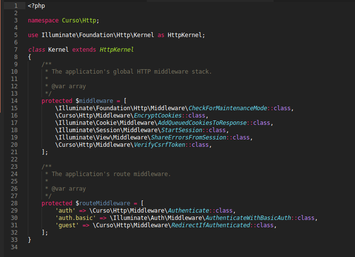
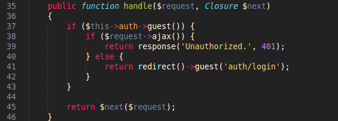

#Middlewares

En este punto debemos tener nuestro CRUD para la clase Pasteles, en caso de no tenerlo recomiendo ver el [Anexo C. CRUD con Laravel](../anexos/crud.md) para poder continuar. Ahora bien si ya podemos realizar las operaciones basicas no podemos pensar en llevar a un ambiente real o comercial un proyecto en este nivel. Aun si funciona correctamente no hemos contemplado todos los posibles casos o amenazas que se encuentran afuera en la Web, tales como son hackers, estafadores o incluso las fallas usuales de los usuarios finales. 

Para solucionar esto Laravel utiliza los Middleware, que nos permiten proteger las rutas de accesos no autorizados, como su nombre lo indica (middle) se ubica en el **medio** de la peticion (Request), entonces si deseamos agregar un nuevo nivel de seguridad a nuestro sistema los Middleware son la respuesta.

Primero vamos a analizar un Middleware para la autenticacion o logeo de los usuarios en nuestras rutas. Por defecto en nuestro proyecto de Laravel debemos de contar con un middleware llamado **auth**, este middleware de lo que se encarga es de ver que el usuario se encuentre con una sesion activa, recuerden que en Laravel ya tenemos por defecto el manejo de sesiones junto con las tablas de la base de datos. Para decirle a nuestro proyecto que las rutas de nuestro controlador de pasteles van a estar protegidas por el middleware auth usamos el metodo **middleware('name');** dentro del constructor de nuestra clase de la siguiente forma:

```
	public function __construct(){
        $this->middleware('auth');
    }
```

Recuerden que esto debe ubicarse dentro de nuestro controlador **PastelesController** como una funcion mas, usualmente esta funcion es la primera que se ve por lo cual recomiendo que al momento de agregar este codigo lo hagan el inicio de su clase.

Con este cambio se daran cuenta de que si ingresan a las rutas en las cuales ya antes podiamos ver nuestro crud los redirige al login, si crean una cuenta de usuario y lo intentan nuevamente veran que el acceso ya se les va a conceder y el nombre e usuario con el que accedan se vera en la barra superior de navegacion al lado derecho, comprobando las sesiones que Laravel nos da como un regalo.

Analizaremos un poco los archivos, siempre es importante saber como funciona lo que estamos usando y no quedarnos solo con la idea de que funciona sin tener la mas remota idea de lo que sucede. Si la autenticacion ya esta hecha esto lo podemos verificar en el archivo ```Kernel.php``` dentro de la ruta ```app/Http/```, en este archivo vamos a ver un codigo similar a este:



en el podemos ver una variable protegida llamada ```$routeMiddleware``` donde estan definidos los middleware del sistema, podemos observar tanto la ubicacion como el nombre con el cual podemos usarlo, estos son **auth**, **auth.basic** y **guest**.

El archivo que hace referencia al middleware **auth** se llama **Authenticate.php** que se encuentra en ```app/Http/Middleware/```, dentro de este archivo podemos observar la estructura de un Middleware normal, este tipo de archivos cuentan con una funcion llamada ```handle()``` que es la que se ejecuta cuando se llama al middleware, la funcion hadle de este archivo es la siguiente:



En ella podemos observar que realiza una serie de preguntas para saber que respuesta dar y a donde redirigir, primero pregunta si el usuario esta logueado con la pregunta ```if($this->auth->guest())```, guest significa invitado y por logica si esta invitado quiere decir que no cuenta con una sesion iniciada. Si ese fuera el caso entonces debemos verificar si el logueo se intenta realizar por medio de AJAX y si la peticion es de este tipo entonces rechazarla y mandar una respuesta de acceso non autorizado, pero si no es de tipo AJAX entonces redirigir directo a la vista de logueo. En el caso de que no sea un invitado entonces quiere decir que si tiene iniciada su sesion por lo cual pasara la peticion al siguiente middleware hasta que llegue al ultimo y termine las veificaciones del sistema.

#Creando nuestros propios Middleware

##Preparativos

Ahora bien, esto no es la solucion a todos nuestros problemas (*aun*), aunque el tener la autenticacion hecha por defecto es una gran ayuda podemos requerir mas proteccion, por ejemplo si manejamos roles en nuestra aplicacion, digamos que el CRUD de pasteles solo lo podemos ver si tenemos una cuenta de administrador en el sistema pero no si tenemos una cuenta normal.

Vamos a modificar algunos archivos para poder aplicar nuestro nuevo middleware, primero la migracion de usuarios llamada **create_users_table.php** en la carpeta de las migraciones, vamos a agregar un campo de tipo de esta forma:

```
<?php

use Illuminate\Database\Schema\Blueprint;
use Illuminate\Database\Migrations\Migration;

class CreateUsersTable extends Migration
{
    /**
     * Run the migrations.
     *
     * @return void
     */
    public function up()
    {
        Schema::create('users', function (Blueprint $table) {
            $table->increments('id');
            $table->string('name');
            $table->string('email')->unique();
            $table->string('password', 60);
            $table->enum('type', ['admin','user']);
            $table->rememberToken();
            $table->timestamps();
        });
    }

    /**
     * Reverse the migrations.
     *
     * @return void
     */
    public function down()
    {
        Schema::drop('users');
    }
}

```

Pero en el modelo de Users que viene por defecto con Laravel 5 se definen los campos que se pueden llenar y los ocultos, vamos a decirle al modelo que tambien puede llenar el campo type de esta forma:

```
	protected $fillable = ['name', 'email', 'password', 'type'];
```

El modelo **User** se encuentra en ```app/Http/```, ahora revisaremos el controlador de registro, es decir el controlador ```AuthController``` en la carpeta ```app/Http/Controllers/Auth/```, buscaremos el metodo create y vamos a dejarlo de esta forma:

```
	protected function create(array $data)
    {
        return User::create([
            'name'     => $data['name'],
            'email'    => $data['email'],
            'password' => bcrypt($data['password']),
            'type'     => $data['type'],
        ]);
    }
```

Hasta ahora solo estamos diciendole al metodo que agregue otro elemento que va a provenir de la vista llamado **'type'**.

Ahora necesitamos poder crear un administrador o un usuario normal, por esto vamos a agregar un campo select en nuestra vista de registro para completar las modificaciones, vamos a modificar la vista ```register.blade.php``` dentro de la carpeta ```resources/views/auth/```. Le vamos a agregar el campo y debera verse de esta forma:

```
@extends('app')
 
@section('content')
<div class="container">
    <div class="row">
        <div class="col-md-6 col-md-offset-3">
            <div class="panel panel-default">
                <div class="panel-heading">Sign Up</div>
 
                <div class="panel-body">
                    {!! Form::open(['route' => 'auth/register', 'class' => 'form']) !!}

                        <div class="form-group">
                            <label>Name</label>
                            {!! Form::input('text', 'name', '', ['class'=> 'form-control']) !!}
                        </div>

                        <div class="form-group">
                            <label>Email</label>
                            {!! Form::email('email', '', ['class'=> 'form-control']) !!}
                        </div>

                        <div class="form-group">
                            <label for="type"> Type</label>
                            <select name="type" class="form-control">
                                <option value="" disabled selected>Elige una opcion...</option>
                                <option value="admin">Administrador</option>
                                <option value="user">Usuario normal</option>
                            </select>
                        </div>

                        <div class="form-group">
                            <label>Password</label>
                            {!! Form::password('password', ['class'=> 'form-control']) !!}
                        </div>

                        <div class="form-group">
                            <label>Password confirmation</label>
                            {!! Form::password('password_confirmation', ['class'=> 'form-control']) !!}
                        </div>

                        <div>
                            {!! Form::submit('send',['class' => 'btn btn-primary']) !!}
                        </div>
                    {!! Form::close() !!}
                </div>
            </div>
        </div>
    </div>
</div>
@endsection
```

##Crear el middleware IsAdmin

Con lo anterior tendremos todos los cambios necesarios para administrar roles en nuestro sistema. Lo siguiente es crear el middleware isAdmin, para esto artisan no provee este comando:

```
	php artisan make:middleware name
```

El comando para nuestro ejemplo seria igual a esto:

```
	php artisan make:middleware IsAdmin
```

esto nos va a crear un archivo dentro de la carpeta ```app/Http/Middleware/``` con el nombre que le dimos con la funcion handle que explicamos anteriormente. Para poder verificar si el usuario logueado es un administrador debemos poder obtener el usuario por lo cual vamos a agregar una clase para poder obtener ese usuario, inyectaremos la dependencia, vamos a crear un atributo que sera la autenticacion que viene del middleware anterior y el constructor de esta forma:

```
<?php

namespace Curso\Http\Middleware;

use Illuminate\Contracts\Auth\Guard;

use Closure;

class IsAdmin
{
    protected $auth;

    public function __construct(Guard $auth)
    {
        $this->auth = $auth;
    }
    /**
     * Handle an incoming request.
     *
     * @param  \Illuminate\Http\Request  $request
     * @param  \Closure  $next
     * @return mixed
     */
    public function handle($request, Closure $next)
    {
        if ($this->auth->user()->type != 'admin') {
            $this->auth->logout();
            if ($request->ajax()) {
                return response('Unauthorized.', 401);
            } else {
                return redirect()->to('auth/login');
            }
        }

        return $next($request);
    }
}

```

Para la logica podemos emular lo que pasa en el Middleware de Authenticate, vamos a preguntar el tipo de usuario y vamos a preguntar si la peticion es AJAX para dirigir la ruta de la peticion a donde sea el caso, si el usuario es de tipo admin entonces vamos a redirigir la peticion al siguiente Middleware, sino entonces vamos a cerrar la sesion y preguntaremos si la peticion es AJAX, en caso de ser AJAX vamos a denegarla, si no entonces vamos a mandar al login. Usaremos la funcion **->to();** porque si nos quedamos con la funcion **guest()** eso guarda la ruta de destino a la que queremos llegar y nunca vamos a poder iniciar sesion con usuarios normales.

Ahora vamos a registrar nuestro middleware para poder usarlo ya que por si mismo no lo vamos a poder integrar al controlador, para esto tenemos que modificar el **Kernel.php**, lo unico aqui es agregar en el **$routeMiddleware** un nombre para nuestro Middleware y la ubicacion del mismo, asi es como se veria:

```
	protected $routeMiddleware = [
        'auth' => \Curso\Http\Middleware\Authenticate::class,
        'auth.basic' => \Illuminate\Auth\Middleware\AuthenticateWithBasicAuth::class,
        'guest' => \Curso\Http\Middleware\RedirectIfAuthenticated::class,
        'is_admin' => \Curso\Http\Middleware\IsAdmin::class,
    ];
```

Entonces con esto ya podemos ligarlo al controlador dentro de su constructor y para cada funcion dentro de este se va a mandar a llamar el Middleware **is_admin**:

```
	public function __construct(){
        $this->middleware('auth');
        $this->middleware('is_admin');
    }
```

Asi podemos probar entrando a una ruta con una cuenta de usuario normal y de nuevo con una cuenta de administrador, entonces veremos que solo si usamos una cuenta de administrador podemos ver lo que ya teniamos al inicio pero de otro modo cerrara la sesion y no nos dejara entrar a ver el contenido.

Para mas informacion lean la [documentacion oficial sobre Middleware](http://laravel.com/docs/5.0/middleware#defining-middleware) de Laravel 5.