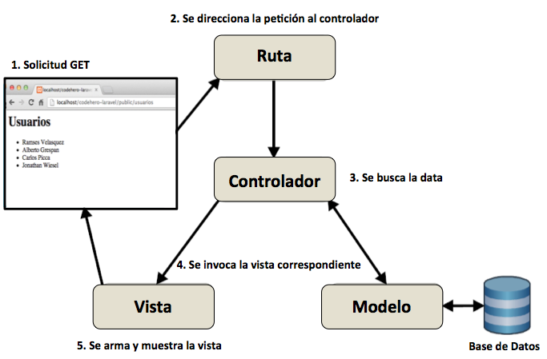
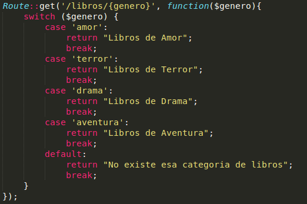
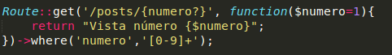

# Enrutamiento básico

La siguiente imágen muestra el proceso que se realiza cuando ingresamos a una URL. Además muestra la arquitectura del patrón [MVC](https://es.wikipedia.org/wiki/Modelo%E2%80%93vista%E2%80%93controlador) que utiliza laravel para el desarrollo de proyectos.



Cuando ingresamos a una url directamente desde el navegador lo hacemos mediante una petición http de tipo GET, esta solicitud se envía al archivo routes.php ubicado dentro de **app/Http/routes.php**, en caso de no existir nos dará un error, si la ruta existe, nos llevará a un controlador en el cuál se encuentra la lógica , el controlador interaccionará con un modelo (opcionalmente) para recuperar información de una base de datos. Esta información llega al controlador y desde el controlador invocamos una vista, las vistas se encuentran en el directorio **resources/views**, finalmente la vista se carga y se muestra en el navegador.

Así es como funciona el modelo MVC (Model-View-Controller).

Supongamos que queremos ingresar a la siguiente URL *http:/dominio.com/saludo* y desplegar una página con el mensaje “Bienvenido :)”.
En laravel la porción /saludo pertenecería a una ruta que regresa una respuesta o una vista dependiendo lo complejo que llegue a ser lo que queramos mostrar. La parte de dominio.com pertenecería a localhost si lo andamos probando de manera local.
En nuestro ejemplo lo que mostraremos es un mensaje muy simple por lo cual no es necesario hacer mostrar una vista.
Para lograrlo haremos lo siguiente:

```
Route::get('saludo', function () {
    return "Bienvenido :)";
});
```

### Tipos de rutas por encabezado Http
Las rutas están siempre declaradas usando la clase Route . Eso es lo que tenemos al principio, antes de :: . La parte get es el método que usamos para ‘capturar’ las peticiones que son realizadas usando el verbo ‘GET’ de HTTP hacia una URL concreta.

Como verás, todas las peticiones realizadas por un navegador web contienen un verbo. La mayoría de las veces, el verbo será GET , que es usado para solicitar una página web. Se envía una petición GET cada vez que escribes una nueva dirección web en tu navegador.

Aunque no es la única petición. También está POST , que es usada para hacer una petición y ofrecer algunos datos. Normalmente se usa para enviar un formulario en la que se necesita enviar los datos sin mostrarlo en la URL.

Hay otros verbos HTTP disponibles. He aquí algunos de los métodos que la clase de enrutado tiene disponible para ti:

```
Route::get();
Route::post();
Route::any();
Route::delete();
Route::put();
```


Cualquier método de la clase Route recibe siempre dos argumentos, el primero es la URI con la que queremos hacer coincidir la URL y el segundo es la función a realizar que en este caso es un Clousure  que no es otra cosa que una función anonima, es decir, que no tiene un nombre.

### Rutas de tipo get
En este caso ocuparemos el método estático **get** para escribir una ruta que responda a una petición de este tipo, las rutas de tipo get son las más usadas.
El método estático **get** recibe como primer parámetro un string indicando la url con la cuál vamos a ingresar, el string "/alumnos" responderá a la solicitud http://localhost:8000/alumnos, el string "/" equivale a htpp://localhost:8000, es decir, la ruta por defecto.
Como segundo parámetro el método estático **get** recibe un `closure` (una función sin nombre) que puede devolver una view o un string.
```
// ruta de tipo GET que devuelve una vista
Route::get('/', function () {
    return view('welcome');
});

// ruta de tipo GET que devuelve un simple string
Route::get('/', function () {
    return "Hola mundo";
});

```

El método **view** dentro del closure recibe como parámetro el nombre de una vista sin la extensión. En el ejemplo de arriba la vista `welcome` se encuentra ubicada en **resources/views/welcome.blade.php** si escribimos `view('pasteles.lista_pasteles')` estamos indicando que regresará el archivo *lista_pasteles.blade.php* ubicado en **resources/views/pasteles/lista_pasteles.blade.php**.

Las rutas pueden ser relacionadas con métodos de un controlador. En el siguiente ejemplo, la ruta http://localhost:8000/home regresará lo que indiquemos en el método index del **Controller** HomeController.

```
Route::get('home', 'HomeController@index');
```

### Parametros en las rutas de tipo get

Los parámetros de las rutas pueden ser utilizados para introducir valores de relleno en tus definiciones de ruta. Esto creará un patrón sobre el cual podamos recoger segmentos de la URI y pasarlos al gestor de la lógica de la aplicación.
Para dejarlo un poco más claro pondremos unos ejemplos.



De igual forma es posible restringir rutas por medio de expresiones regulares como por ejemplo:



En la imagen anterior podemos ver dos conceptos nuevos, el uso de valores por default lo cúal logramos con el simbolo (?) despues del nombre de la variable y en la función asignandole un valor por defecto, en este caso el entero 1.

Lo segundo que vemos es el uso del método `where` el cúal nos permite establecer expresiones regulares a las variables que usamos en la construcción de las URIs.
