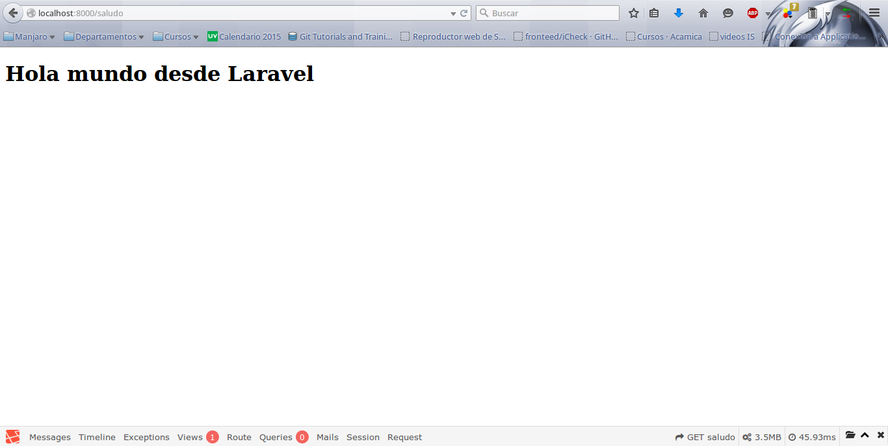
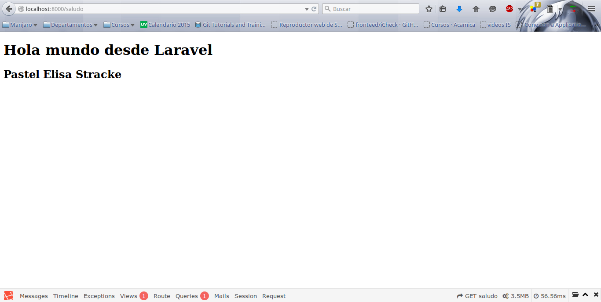
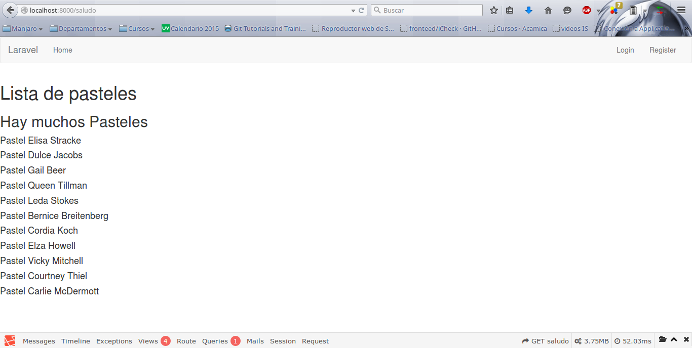

#Vistas y Blade

Las vistas en Laravel son la parte publica que el usuario de nuestro sistema va a poder ver, se escriben en HTML junto con un motor de plantillas llamado **Blade** que veremos mas adelante. Las vistas se encuentran ubicadas en la carpeta ```resources/views/``` y Laravel por defecto trabaja con la idea de que tenemos que escribir la menor cantidad de codigo repetido, modularizar nuestro codigo en donde mas se pueda, y si esto lo aplicamos en nuestros modelos, controladores y demas partes de nuestro proyecto.


Entonces, **¿Por que no hacerlo tambien en las vistas?**, pues bien, Laravel usa unos archivos que se llaman plantillas o **templates** que suelen ser nuestros archivos principales, que tienen los segmentos de codigo que se repiten en mas de una vista, como por ejemplo la barra de navegacion, un menu de opciones, la estructura del acomodo de nuestro proyecto, etc. y como deben de estar practicamente presentes en todos lados, no tiene sentido estarlos repitiendo en todas las vistas. Por defecto Laravel contiene un **template** llamado **app.blade.php**, usualmente los **templates** contienen el head del HTML, las ligas del [CSS](https://es.wikipedia.org/wiki/Hoja_de_estilos_en_cascada) del sistema y una seccion exclusiva para los archivos Javascript.

Ademas de los **templates**, se cuentan con archivos que se llaman **partials**, estos archivos son pequeños segmentos de codigo que suelen ser usados comunmente en partes del sistema en especifico, como los formularios o secciones de mensajes, estos archivos surgen por el codigo que es mas pequeño que repetimos mucho pero no es lo suficientemente grande como para considerarlo un **template**.

Esto hace que las vistas de cada parte del proyecto, que suelen ser llamadas por una ruta o controlador sean mucho mas pequeñas que usando otro tipo de frameworks para desarrollo Web, y para poder unir todos estos archivos o *piezas del rompecabezas* usamos el motor de plantillas de Laravel llamado **BLADE**.

Antes de ver mas sobre el motor de plantillas **Blade**, veremos como trabajar con las Vistas y llamarlas desde una ruta, crearemos un vista simple con un archivo nuevo en la carpeta ```resources/views/``` llamado **saludo.blade.php** con el siguiente codigo:

```html
<!DOCTYPE html>
<html>
<head>
	<meta charset="utf-8">
	<meta http-equiv="X-UA-Compatible" content="IE=edge">
	<title>Vista ejemplo</title>
</head>
<body>
	<h1>Hola mundo desde Laravel</h1>
</body>
</html>
```

Es un HTML simple con un titulo 1, ahora vamos a crear una ruta que nos muestre esta vista:

```php
Route::get('saludo', function(){
	return view('saludo');
});
```

De esta forma con la función view() le estamos diciendo a Larael que busque dentro de la carpeta ```resources/views/``` la vista **saludo.blade.php**, por convension las vistas Laravel no necesita que especifiquemos la extension ***.blade.php***, sino solo su nombre. Una vez hecho esto debemos ver este resultado o uno similar:



Continuando con el ejemplo de los Pasteles vamos a mandar a la vista el nombre de un pastel, dentro de la ruta saludo vamos a obtener el primer Pastel de chocolate de nuestra BD y a poner ese nombre en vez del mensaje. Para esto podemos usar el scope de sabor para obtener los pasteles de chocolate y despues decirle que con el metodo first() nos regrese el primer pastel y eso guardaro en una variable, dejando la ruta de la siguiente forma:

```php
	Route::get('saludo', function(){
		$pastel = Pastel::sabor('chocolate')->first();
		return view('saludo')->with('pastel', $pastel->nombre);
	});
```

De esta forma estamos diciendo a la ruta que nos regrese la vista **saludo.blade.php** con una variable llamada pastel, que es el nombre del pastel, pero esto por si solo no lo va a mostrar el navegador, solo va a mandar la variable, para que el navegador la muestre debemos agregar un titulo donde este esa variable de esta forma:

```html
<h2>{{ $pastel }}</h2>
```

Esta linea va justo abajo del mensaje **Hola mundo desde Laravel**, y ahora si debemos de ver algo parecido a esto ya que nuestras BD tienen cosas diferentes y gracias a Faker ninguno de nuestros resultados deberia ser igual:



Ahora si bien usamos los caracteres **{{ }}** y no sabemos bien que son, esto es parte de la sintaxis que ahora veremos con **Blade**.

#Blade

**Blade** nos provee de muchas ventajas *(asi como casi todo en Laravel)*, ademas de modularizar nuestras vistas de una forma sorprendente, tambien nos permite usar estructuras de control y variables de PHP ¡directamente en ellas!, esto ya era posible antes usando las etiquetas de php, por ejemplo:

```php
<?php echo $var ?>

<?= $var ?>
```

Pero esto ademas de ser un poco incomodo de escribir deja nuestras vistas mucho mas dificiles de entender y sucias por la mezcla de tanto codigo.

Entonces para el ejemplo anterior usamos el siguiente codigo:

```php
{{ $pastel }}
```

Esto es el equivalente a ```<?= $pastel ?>``` y aunque con un ejemplo tan sencillo no se ve demasiada diferencia, con lo siguiente podremos verificar la potencia de este motor de plantillas.

Usualmente las estructuras de control que conocemos las usamos en los archivos PHP dedicados al Back-end (lado del servidor), pero blade nos da una sintaxis muy comoda para este tipo de estructuras que con PHP plano son muy sucias e incomodas de usar.

Para cada una de estas estructuras como lo son **If**, **else**, **elseif**, **for**, **foreach**, etc., se antepone un **@** para usar estas estructuras y listo!! eso en suficiente, pero a diferencia de como estamos a costumbrados de encapsular un grupo de sentencias o lineas de codigo con llabes **{ }**, en blade definimos el fin de una estructura con un **@end** seguido del nombre de la estructura que usamos, por ejemplo:

```
<h1>Lista de pasteles</h1>
@foreach($pasteles as $pastel)
	<h2>{{ $pastel->nombre }}</h2>
@endforeach
```

Entonces en la ruta donde regresamos solo un nombre de un pastel, podriamos regresar todos los pasteles y escribir una lista de todo los pasteles de un cierto sabor e imprimirla en la vista.

Un ejemplo para el **if** seria:

```
@if( $pasteles->count() > 10 )
	<h1>Hay muchos Pasteles</h1>
@endif
<h1>Lista de pasteles</h1>
@foreach($pasteles as $pastel)
	<h2>{{ $pastel->nombre }}</h2>
@endforeach
```

El if nos dice, si el numero de pasteles que recibimos es mayor a 10 entonces escribe el titulo **Hay muchos Pasteles**.

Esto aplica para todas las estructuras, su logica es la misma pero solo cambia un poco su sintaxis, pero hace que el HTML quede mas limpio que si incrustaramos PHP plano dentro de nuestra vista.

Templates y Partials
=======

Anteriormente hablabamos de **templates** y **partials**, describiremos un poco de como se trabaja con esta estructuras de Blade y sus beneficios:

###Templates

Estos archivos como se menciona al principio del capitulo son plantillas que nos ahorran mucho codigo o leguaje HTML, y para usar un **template** se usa la sentencia:

```
@extends('template')
```

Claramente se tendria que sustituir la palabra **template** dentro de la sentencia **extends** por el nombre de la vista que va a funcionar como **template** o **plantilla**.

Un template es una vista como las demas, simplemente que dentro de ella se usan otras sentencias que nos va  a permitir definir areas del archivo que se van a poder sustituir mas adelante dentro de otra vista si es que lo deseamos. Para esto se ocupa la sentencia:

```
@yield('nombre_seccion')
``` 

Para declarar un area que se definira en otra vista o bien la sentencia:

```
@section('nombre_seccion')
```

que funciona de la misma forma que **yield()** con la diferencia que en la seccion puedes definir HTML por defecto en caso de no definir la seccion con un nuevo HTML.

Definiremos nuestra vista recien creada **saludo.blade.php** para que use un template, por defecto Laravel trae uno que se llama **app.blade.php**, ese es el que usaremos para este ejemplo.

El template **app** por defecto tiene definida un **yield** llamado **content** que significa contenido, por lo cual la lista de pasteles que tenemos la vamos a agregar en esta parte y la vista quedaria de la siguiente forma:

```html
@extends('app')

@section('content')
    <h1>Lista de pasteles</h1><br>
    @if( $pasteles->count() > 10 )
        <h2>Hay muchos Pasteles</h2><br>
    @endif
    @foreach($pasteles as $pastel)
        <h4>{{ $pastel->nombre }}</h4>
    @endforeach
@stop
```

Ahora nuestra vista ya no tiene el encabezado HTML normal ni las etiquetas **<body>** ni **<html>**, sino que estamos diciendo que vamos a extender del template **app** y que el yield **content** lo vamos a sustituir por nuestro propio contenido, cabe mencionar que aunque en el template se uso la sentencia **yield('content')**, al momento de sustituirla la vamos a cambiar por **section('content')**, por lo cual en todas las vistas hijas del template solo se va a definir secciones y el fin de esa seccion se va a declarar con la entencia ```@stop```.

Ahora el resultado seria algo parecido a esto:



Nos podemos dar cuenta que cambiaron muchas cosas, ahora tenemos una barra de navegacion en la parte superior de la ventana y el debugbar en la parte inferior, ademas de que la tipografia ha cambiado. Esto es porque dentro del template app se estan agregando hojas de estilo [CSS](https://es.wikipedia.org/wiki/Hoja_de_estilos_en_cascada).

###Partials

Continuaremos con los partials, basicamente es lo mismo que ya hemos visto pero con una sentencia mas que se llama ```include('nombre.partial')```, la cual esta incluyendo o incrustando un archivo mas de HTML, podemos hacer un simil con los **use** de PSR-4 o los **import** de Java, a diferencia de que esto lo inlcuye justo en el lugar donde lo definimos.

**Vamos a verlo con un ejemplo practico**.

Dentro la actual vista **saludo.blade.php**, vamos a quitar todo el HTML Blade que definimos para crear esta lista pequeña de pasteles y lo vamos a guardar en nuevo archivo, para esto vamos a crear una carpeta llamada pasteles y dentro otra carpeta llamada partials, donde vamos a guardar la vista de nuestro nuevo partial, quedando la ruta de la siguiente forma: ```resources/views/pasteles/partials/```.

Ahi vamos a crear un archivo llamado **lista.blade.php** y dentro de este archivo vamos a cortar el codigo de nuestra vista saludo, quedando asi:

```html
	<h1>Lista de pasteles</h1><br>
    @if( $pasteles->count() > 10 )
        <h2>Hay muchos Pasteles</h2><br>
    @endif
    @foreach($pasteles as $pastel)
        <h4>{{ $pastel->nombre }}</h4>
    @endforeach
```

Y nuestra vista **saludo.blade.php** quedaria de esta forma una vez que ya incluyamos nuestro partial:

```html
@extends('app')

@section('content')
    @include('pasteles.partials.lista')
@stop
```

Si todo lo hacemos bien nuestra vista en el navegador debe seguir viendo de la misma manera, pero si se dan cuenta ahora se encuentra mucho mas modular nuestro HTML, si la lista de Pasteles la necesitaramos en otra vista ahora solo necesitamos hacer un ```@include('pasteles.partials.lista')``` y con eso ya tendremos nuestra lista agregada en cualquier vista donde la necesitemos.

Para mas informacion de **Blade** podemos ir a la [documentacion oficial de Laravel sobre templates](http://laravel.com/docs/5.0/templates).