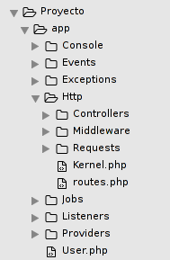
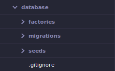
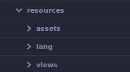
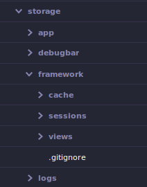

# Estructura de un proyecto en Laravel
Todos los proyectos nuevos en Laravel 5.1 tienen la siguiente estructura de directorios:

* app/
* bootstrap/
* config/
* database/
* public/
* resources/
* storage/
* tests/
* vendor/
* .env
* .env.example
* .gitattributes
* .gitignore
* artisan
* composer.json
* composer.lock
* gulpfile.js
* package.json
* phpspec.yml
* phpunit.xml
* readme.md
* server.php

A continuación describiremos los directorios y archivos más importantes que nos ayuden a entender más el funcionamiento del framework.

### El directorio app

App es usado para ofrecer un hogar por defecto a todo el código personal de tu proyecto. Eso incluye clases que puedan ofrecer funcionalidad a la aplicación, archivos de configuración y más. Es considerado el directorio más importante de nuestro proyecto ya que es en el que más trabajaremos.

El directorio app tiene a su vez otros subdirectorios importantes pero uno de los más utilizados es el directorio **Http** en el cuál ubicaremos nuestros `Controllers`, `Middlewares` y `Requests`en sus carpetas correspondientes, además dentro del subdirectorio **Http** encontremos también el archivo `routes.php` el cuál es el archivo en el que escribiremos las rutas de la aplicación.

A nivel de la raíz del directorio app encontraremos el modelo `User.php`, los modelos comunmente se ubicarán a nivel de la raíz de la carpeta app aunque igual es posible estructurarlos de la forma que queramos en una carpeta llamada `Models`por ejemplo.

### El directorio config

La configuración tanto para el framework como para tu aplicación se mantiene en este directorio. La configuración de Laravel existe como un conjunto de archivos PHP que contienen matrices clave-valor. 
Entre los archivos más usados del directorio config se encuentran:

* app.php : En este archivo nos puede interesar configurar el lenguaje de nuestra aplicación, la zona horaria, los providers y aliases de las clases más comunes.
* database.php : En este archivo podemos configurar principalmente el motor de base de datos al cuál deseamos conectarnos.

### El directorio database

Aquí se encontraran los archivos relacionados con el manejo de la base de datos. Dentro de este directorio se encuentran los subdirectorios:

* factories : Aquí escribiremos nuestros model factories.
* migrations : Todas las migraciones que creamos se ubican en este subdirectorio.
* seeds : Contiene todas las clases de tipo seed.

### El directorio public

Dentro de este directorio colocaremos todos los recursos estáticos de nuestra aplicación, es decir, archivos css, js, imágenes y fuentes.

Es recomendable crear una carpeta por cada tipo de recurso.

### El directorio resources

Dentro de este directorio se encuentran los subdirectorios:

* assets : Aquí se ubican todos los archivos less de nuestra aplicación (útil para desarrolladores front-end).
* lang : Aquí se encuentran todos los archivos de internacionalización, es decir, los archivos para poder pasar nuestro proyecto de un idioma a otro. Normalmente habrá una carpeta por cada idioma, ejemplo:
    * en : idioma inglés
    * es : idioma español 
* views : Aquí ubicaremos nuestras vistas en formato php o php.blade, es recomendable crear una carpeta por cada controlador, además agregar una carpeta **templates** para las plantillas. Una plantilla es una vista general, que tiene segmentos que pueden ser reemplazados mediante la herencia de plantillas, más adelante se hablará de este tema.

### El directorio storage

Cuando Laravel necesita escribir algo en el disco, lo hace en el directorio storage . Por este motivo, tu servidor web debe poder escribir en esta ubicación. Aquí podemos encontrar otros directorios entre los cuales el más relevante es el subdirectorio framework, es ahí donde se almacena el cache y las vistas compiladas.

### El directorio tests

Aquí escribiremos los archivos de pruebas que serán ejecutadas posteriormente por phpunit.

### El archivo .env y .env.example

El archivo .env no existe cuando instalamos laravel, en este archivo se configurará el modo en que se ejecuta nuestra aplicación, por defecto será el modo debug, además podemos configurar la conexión a la base de datos y la conexión con el servidor de correo electronico. El archivo .env lo creamos copiando el archivo **.env.example** y renombrando la copia como **.env**.

Por motivos de seguridad de la base de datos el archivo .env nunca se sube cuando hacemos un push en nuestro repositorio. Es por eso que aparece escrito dentro del archivo **.gitignore** en la raíz de nuestro proyecto.
=======

>>>>>>> 9691b265706719592a4af22b2a276b96764eb16b
